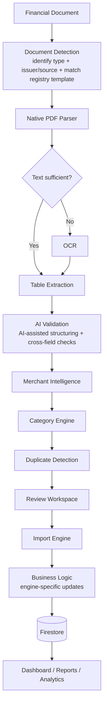
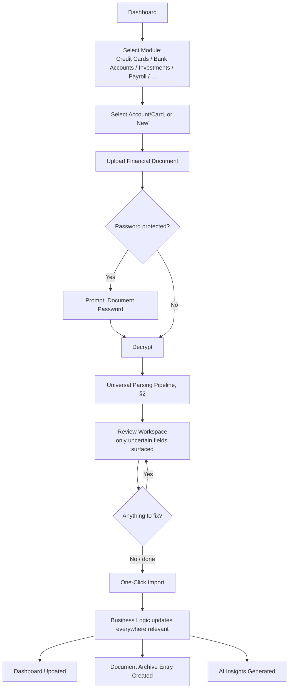
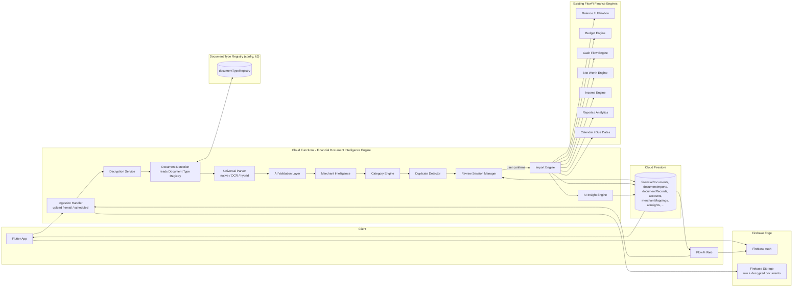
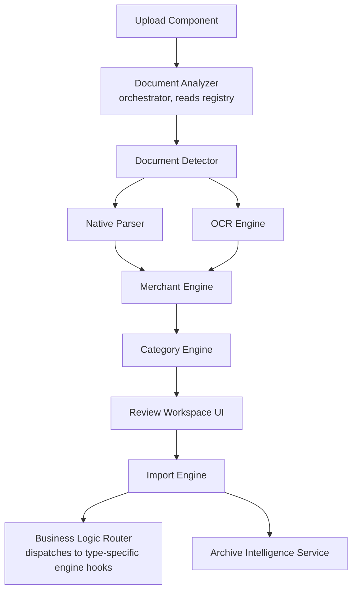
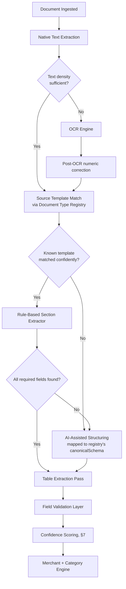
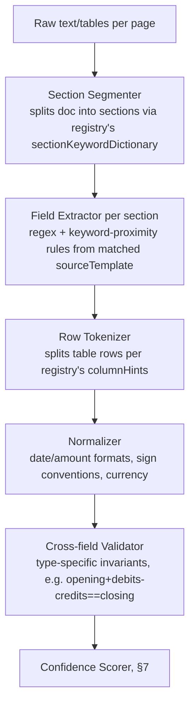
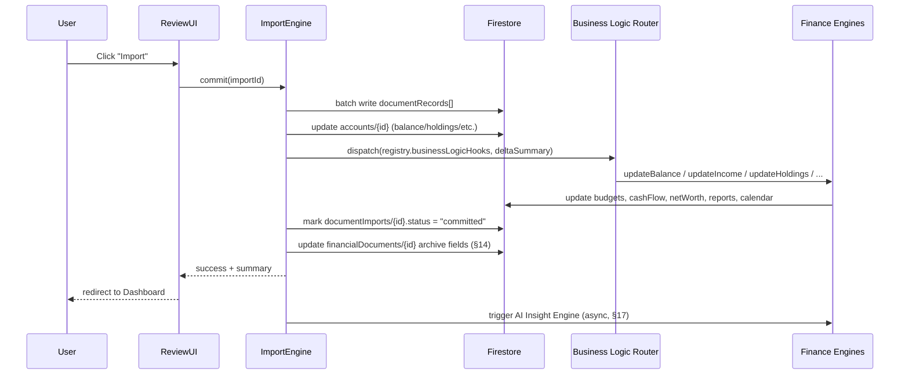
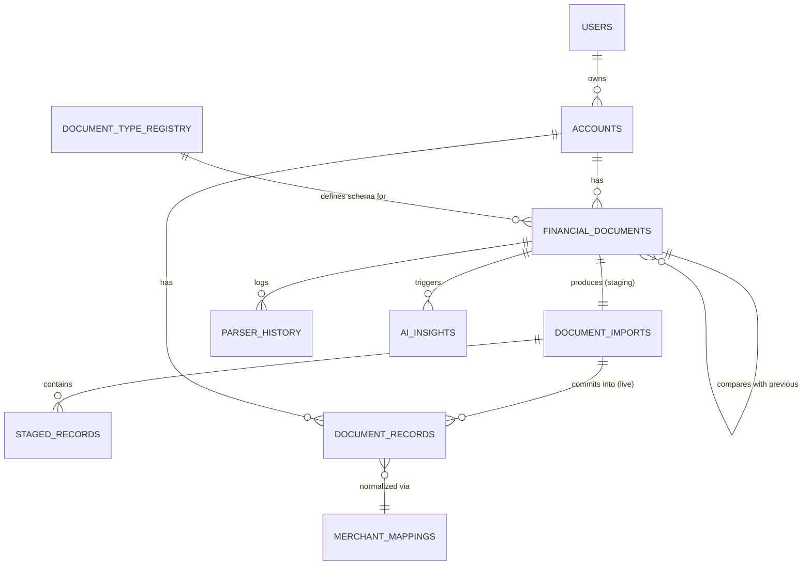
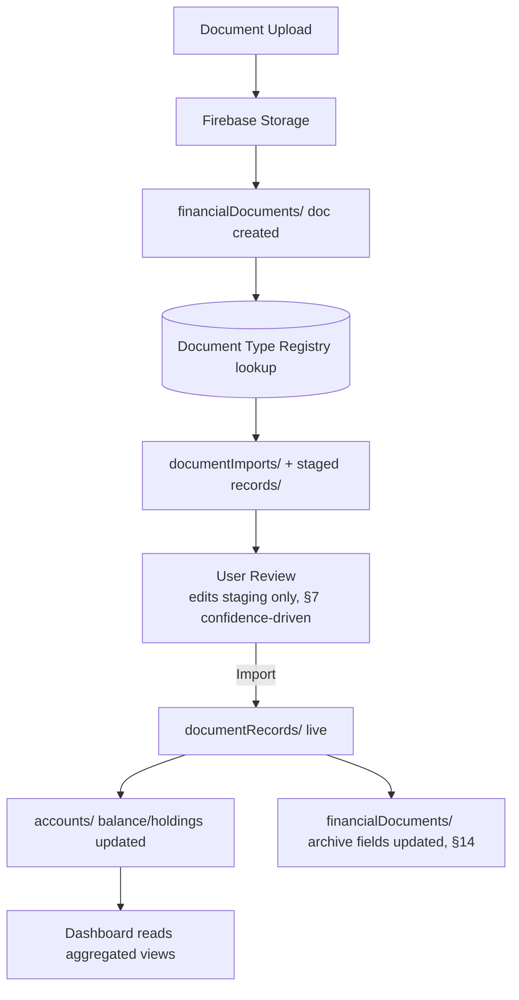
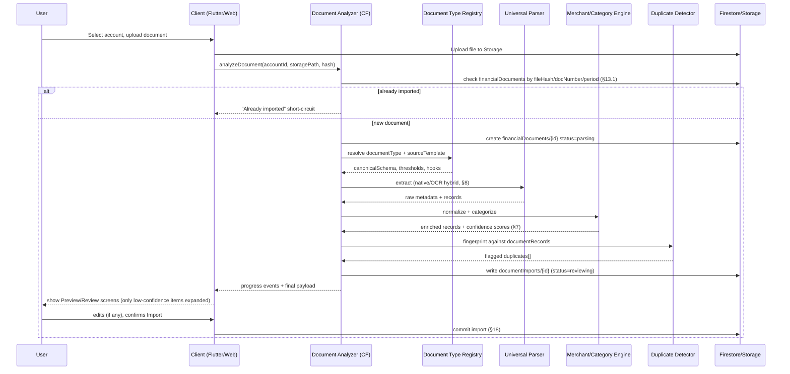

# FlowFi Financial Document Intelligence Engine
### Architecture v1.0

**Status: 🔒 Architecture Locked**
This document is the single source of truth for development. No new features, no new architecture, and no speculative improvements are to be added from this point forward. Only implementation-driven refinements — corrections discovered while building against this spec — are permitted, and any such refinement must be logged as a deviation with a reason, not silently merged into the original design. The engineering backlog derived from this document lives in a separate artifact (*FlowFi FDIE — Implementation Backlog*).
**Scope:** Flutter app (existing, 90% complete) + FlowFi Web (Next.js 16 / React 19 / TS / Tailwind v4) sharing one Firebase backend (Auth, Firestore, Storage)
**Author context:** Single source of truth for parsing/import logic, consumed by both clients, zero duplicated business logic
**v2 change note:** v1 designed a Credit Card Statement Parser. v2 generalizes that design into a **universal Financial Document Intelligence Engine**, with Credit Card Statements as the first of many pluggable document modules. The core pipeline, hybrid parsing tiers, staging/live data split, and Firestore-centric orchestration from v1 are preserved unchanged — see §0 for exactly what moved and why.

---

## 0. What Changed From v1 (and what didn't)

This is a generalization, not a rewrite. The v1 architecture already had the right shape; v2 promotes it from "hardcoded for credit cards" to "data-driven for any financial document."

| v1 concept | v2 concept | Why |
|---|---|---|
| Statement Parser (credit-card-specific) | **Financial Document Intelligence Engine** — one pipeline, N document modules | Same code path handles a credit card statement, a payslip, or a GST invoice; only the *template dictionary* and *canonical schema* differ per module |
| Issuer template dictionary (hardcoded to banks) | **Document Type Registry** — a Firestore-backed config collection, one entry per module | Adding "Salary Slip" support becomes a data change, not a redesign |
| `statements/{id}` | `financialDocuments/{id}` (+ `documentType` field) | One collection, discriminated by type, instead of a new top-level collection per module |
| `statementImports/{id}` | `documentImports/{id}` | Same staging concept, generalized name |
| `statementTransactions/{id}` | `documentRecords/{id}` (+ `recordType`: transaction / holding / earning / lineItem / installment...) | Not every document produces a "transaction" — a payslip produces earnings/deductions, an investment statement produces holdings |
| Card-only duplicate signals | Card/account + **statement number** + period + fingerprint + hash (§13) | Statement number is a stronger signal than date-range alone and was missing in v1 |
| Confidence score (implicit, per-field) | **Parser Confidence Engine** — first-class subsystem with per-field thresholds and UI rules (§7) | v1 mentioned confidence in passing; it's now a designed subsystem since it's the lever that keeps Review effortless |
| Statement Archive (PDF + metadata) | **Document Archive Intelligence** — versioned, comparison-aware, AI-summarized (§14) | Explicit ask: archive should be a historical intelligence layer, not a file cabinet |

Nothing about the pipeline order, the hybrid parsing strategy, the staging-vs-live Firestore split, or the atomic-commit import model changes. Those were sound and are the parts explicitly asked to be preserved.

---

## 1. Product Vision

FlowFi should feel like the user handed every financial document they own to a private analyst — not just credit card statements, but bank statements, payslips, investment reports, GST bills, tax documents. One upload experience, one intelligence engine, one dashboard that reconciles all of it.

Design pillars (updated):

1. **One engine, many document types** — Credit Card Statements, Bank Statements, UPI Statements, Loan Statements, Investment Statements, Salary Slips, GST Bills, Receipts, Tax Documents, and Email-sourced statements all flow through the same pipeline. A new document type is a **plugin** (schema + template dictionary + category set), never a parallel system.
2. **Zero-schema-lock-in ingestion** — every issuer/format differs; the parser degrades gracefully instead of hard-failing on unknown layouts, for any document type.
3. **Human-in-the-loop, not human-required** — the Parser Confidence Engine (§7) means the user reviews *only what the system is unsure about*. High-confidence documents import in one click with zero review.
4. **One brain, many surfaces** — Flutter and Web never re-implement parsing/categorization independently. All intelligence lives in shared backend logic (Cloud Functions); both clients are thin.
5. **Extensible by construction, not by refactor** — five years from now, adding "Tax Document Parsing" should mean writing a new registry entry, not touching the orchestrator, the Review UI, or the Import Engine.

---

## 2. Universal Parsing Pipeline

This is now the core architecture — every document type, present and future, flows through exactly these stages. Document-type-specific behavior is confined to the shaded stages (Detection, Native Parser/OCR specifics, Category Engine, Business Logic); everything else is shared, unmodified code.



**Stage responsibilities:**

| Stage | Shared across all document types? | Notes |
|---|---|---|
| Document Detection | Shared orchestration, type-specific fingerprints | Determines *both* the document type (credit card vs. payslip vs. GST bill) and the issuer/source template within that type — see §6 |
| Native PDF Parser | Fully shared | Text-layer extraction is identical regardless of document type |
| OCR | Fully shared | Same fallback engine for any scanned document |
| Table Extraction | Fully shared, template tells it *where* the table is | Row/column geometry recovery is generic |
| AI Validation | Fully shared, schema is type-specific | The LLM structuring step is handed the target canonical schema (§8.1) for whichever document type was detected |
| Merchant Intelligence | Shared, applies to any document with counterparty names (statements, receipts, invoices); no-op for documents without merchants (e.g. salary slips, holdings) | See §9 |
| Category Engine | Shared engine, type-specific category enum | A payslip's "categories" are earnings/deductions codes, not spend categories — same engine, different enum plugged in via registry |
| Duplicate Detection | Fully shared | Fingerprint inputs are type-aware (§13) but the algorithm and UX are identical |
| Review Workspace | Fully shared UI | Renders whatever canonical schema the document type declares |
| Import Engine | Fully shared commit mechanics | *What* gets written (which Business Logic hooks fire) is type-specific |
| Business Logic | Type-specific | Credit card import updates balance/utilization; a payslip import updates Income tracking; an investment statement updates Net Worth holdings |
| Firestore | Shared, discriminated by `documentType` | See §12 |

---

## 3. Document Type Registry — The Plugin Model

This is the mechanism that makes "add a new document type without redesigning the system" real rather than aspirational.

```
documentTypeRegistry/{documentType}
  documentType: "credit_card_statement" | "bank_statement" | "upi_statement" |
                "loan_statement" | "investment_statement" | "salary_slip" |
                "gst_invoice" | "receipt" | "tax_document" | ...
  displayName, icon, ingestionMethods: ["upload","email_import","auto_monthly"]
  canonicalSchema: { metadataFields[], recordSchema }        -- §8.1 shape
  sectionKeywordDictionary: { fieldName -> [synonyms across sources] }
  sourceTemplates: [ { sourceId, displayName, fingerprintKeywords[],
                        columnHints, dateFormats[], amountConventions } ]
  categoryEnum: [ ... ]                                       -- type-specific
  merchantIntelligenceEnabled: bool
  duplicateFingerprintFields: [ ... ]                         -- §13
  businessLogicHooks: [ "updateCardBalance", "updateIncome", "updateHoldings", ... ]
  confidenceThresholds: { field -> minConfidence }            -- §7
  status: "active" | "beta" | "reserved"                      -- §15 features ship as "reserved" first
```

Everything the orchestrator needs to run a document through the universal pipeline (§2) is read from this one registry entry. **Onboarding a new document type is: write a registry entry + (optionally) a small set of source templates for known issuers/formats.** No changes to Document Detection's control flow, the Review Workspace component, the Import Engine's commit mechanics, or the Firestore access layer.

This directly generalizes v1's "issuer template dictionary" (§6 in v1) from "hardcoded to 13 banks" to "one row per bank *within* the `credit_card_statement` registry entry's `sourceTemplates` array" — the credit-card module is simply the first, most fully populated registry entry.

---

## 4. End-to-End UX Flow



The credit-card flow described in v1 (Dashboard → Credit Cards → Select Card → Upload → Password → Analyze → Preview → Review → Import) is the **first concrete instantiation** of this generalized flow. Every future module (Bank Statements, Payroll, Investments…) reuses the same screen shapes with different field labels, sourced from the registry entry's `canonicalSchema`.

### 4.1 Screen-by-screen (generalized, wireframe description, no code)

**Screen 1 — Module / Account Selector**
Grid of account tiles scoped to the active module (credit cards, bank accounts, investment accounts, …), each carrying whatever metadata that module's registry entry declares as priors (for credit cards: billing cycle, statement day, due day, credit limit, issuer, network).

**Screen 2 — Upload**
Drag-and-drop / file-picker. Format badges shown are pulled from the registry's `ingestionMethods` + supported formats for that document type (Native PDF ✓, Password-protected ✓, Multi-page ✓, Scanned (OCR) — *Beta*, Email import — *if enabled*). Client computes a SHA-256 hash pre-upload for instant duplicate short-circuit (§13).

**Screen 3 — Password Prompt** (conditional, identical across all document types)

**Screen 4 — Analyzing**
Progress stages narrated from the Universal Pipeline (§2): "Detecting document type… Reading pages… Extracting fields… Categorizing… Checking duplicates…"

**Screen 5 — Preview / Document Summary**
Summary card populated from whatever `canonicalSchema.metadataFields` the detected document type declares (for credit cards: Statement Period, Total Due, Minimum Due, Due Date, Available Limit, Utilization gauge; for a payslip: Gross Pay, Deductions, Net Pay).

**Screen 6 — Review Workspace** (see §10 — this is the screen most changed by the Confidence Engine)
Only rows/fields below the type's confidence threshold are expanded by default; everything else is collapsed into a single "✓ 74 items auto-verified" summary row the user can still expand manually. Row actions unchanged from v1: Edit, Delete, Split, Merge, Tag, Note.

**Screen 7 — Import Confirmation**
Diff-style summary + explicit "Import" button — the one true write boundary.

**Screen 8 — Post-Import**
Dashboard redirect + "what changed" delta card + new Document Archive entry.

**Screen 9 — Document Archive** (see §14 — substantially expanded from v1)

**Screen 10 — AI Insights** (see §11 — expanded list)

---

## 5. System Architecture



**Key architectural decision (unchanged from v1):** all parsing/intelligence lives in Cloud Functions, never in clients. **New in v2:** the orchestrator is now driven by the Document Type Registry rather than hardcoded issuer logic — this is the single change that converts a credit-card feature into a platform.

---

## 6. Component Architecture



- **Document Analyzer** replaces v1's "Statement Analyzer" — same orchestrator/state-machine role, now parameterized by the registry entry for the detected type instead of being credit-card-specific.
- **Document Detector** runs a two-stage match: which **document type** (credit card / payslip / GST bill / …), then which **source template** within that type (which bank / which payroll vendor format) — see §6 of v1, generalized in §16 below.
- **Business Logic Router** is new: previously the Import Engine called a fixed set of finance engines directly; now it dispatches to whichever `businessLogicHooks` the registry entry declares, so a payslip import can call `updateIncome` while a credit card import calls `updateCardBalance`, through one Import Engine implementation.
- **Archive Intelligence Service** is substantially expanded from v1's "append-only metadata" — see §14.

---

## 7. Parser Confidence Engine

This is the subsystem that makes "review only what's uncertain" possible — promoted from an implicit detail in v1 to a first-class design piece.

### 7.1 How a confidence score is computed

Every extracted field/record carries a 0–100% score derived from:

1. **Extraction tier used** (rule-based > table-extraction > AI-assisted > OCR — highest tier that succeeded sets the ceiling).
2. **Cross-field validation** (e.g., opening + debits − credits ≈ closing; gross − deductions ≈ net pay) — pass raises confidence, fail caps it hard regardless of tier.
3. **Pattern-match strength** (exact known-format match vs. fuzzy/inferred).
4. **Registry lookup strength** for merchant/category (exact alias match vs. fuzzy vs. novel).

### 7.2 Example scores (illustrative)

| Field | Example value | Confidence | Why |
|---|---|---|---|
| Merchant | "Amazon" (normalized from "AMAZON INDIA PVT") | 98% | Exact alias match in `merchantMappings` |
| Amount | ₹4,999.00 | 100% | Numeric column, unambiguous, passes cross-field validation |
| Date | 12 Jul 2026 | 99% | Matched known date pattern for detected template |
| Category | Shopping | 83% | Merchant→category table match, but merchant itself was a fuzzy (not exact) match |
| Merchant | "XYZ TRD 4471 BLR" (unrecognized) | 55% | No alias match, no fuzzy match above threshold — provisional/new merchant |

### 7.3 Per-field / per-type thresholds

Thresholds live in `documentTypeRegistry/{type}.confidenceThresholds` (not hardcoded), because "acceptable confidence" differs by field importance: an amount below 95% confidence should almost always surface for review (money must be exact), while a category below 85% is a minor annoyance, not a risk — importing at 80%-confidence category and letting the user recategorize later is an acceptable trade FlowFi is willing to make, but importing at 80%-confidence *amount* is not.

Suggested default tiers:

| Field class | Auto-accept above | Always shown, but not blocking, above | Forces review below |
|---|---|---|---|
| Amount, Date, Direction (debit/credit) | 97% | — | 97% |
| Merchant | 90% | 75–90% | 75% |
| Category, Subcategory | 85% | 60–85% | 60% |
| Optional fields (reference, location) | 70% | — | never blocks import |

### 7.4 UI behavior

- The Review Workspace (§10) **collapses** every record whose *lowest-confidence field* is above that field class's threshold into a single "auto-verified" summary count.
- Only records with at least one below-threshold field are expanded by default, with that specific field highlighted (not the whole row flagged generically) — e.g., only the Category cell is amber, Merchant/Amount/Date stay unhighlighted if they're confident.
- A document whose **metadata-level** cross-field validation fails (opening/closing balance mismatch) is flagged `needs_review` at the document level regardless of individual field scores — this is a hard stop, not a soft nudge, because it usually means a missing page or misparse.
- Confidence badges use plain-language tiers in the UI (High / Medium / Low) with the numeric score available on hover — users shouldn't need to interpret "83%" cognitively, but power users can.

---

## 8. PDF Parsing Strategy

(Unchanged from v1 — this comparison and the resulting hybrid, confidence-tiered pipeline are format-agnostic and apply identically to every document type.)

| Approach | Strength | Weakness | Use in FlowFi |
|---|---|---|---|
| **Native PDF text extraction** | Fast, cheap, high fidelity for digitally-generated documents | Breaks on scanned images / unstructured multi-column tables | **Primary path** |
| **Table extraction** | Recovers row/column structure for transaction/line-item tables | Needs page geometry, brittle across sources | **Secondary pass** on the detected table region |
| **OCR** | Only way to read scanned/photographed documents | Slow, costly, error-prone on numbers | **Fallback**, triggered only on image-only pages |
| **AI-assisted extraction** | Handles novel/unseen layouts, normalizes label vocabulary | Latency + cost, needs strict output validation against the registry's canonical schema | **Structuring layer**, text/tables only, never raw images (cost control) |
| **Rule-based extraction** | Deterministic, fast, free | Doesn't generalize to unseen sources | **First-pass fast lane** for known source templates (§16); falls through to AI-assisted when confidence is low |



Cost/latency reasoning is unchanged: rule-based extraction handles the large majority of repeat-source documents nearly free; AI-assisted structuring is the safety net for novel layouts, not the default; OCR only runs on provably image-only pages.

---

## 9. Document Layout Analysis — Module: Credit Card Statements

The credit-card module remains the most fully populated `sourceTemplates` set in the registry. (Unchanged content from v1, now explicitly scoped as one module's data, not the whole system's logic.)

| Section (canonical) | HDFC | ICICI | Axis | SBI | Kotak | IDFC | Federal | Amex | OneCard | AU | HSBC | IndusInd | Standard Chartered |
|---|---|---|---|---|---|---|---|---|---|---|---|---|---|
| Summary | "Statement Summary" | "Account Summary" | "Statement Summary" | "Summary of Charges" | "Statement Summary" | "Summary" | "Card Summary" | "Summary" | "Bill Summary" | "Statement Summary" | "Summary" | "Statement Summary" | "Summary" |
| Total Due | "Total Dues" | "Total Amount Due" | "Total Payment Due" | "Total Amount Due" | "Total Due" | "Total Due Amount" | "Total Amount Due" | "New Balance" | "Total Due" | "Total Amount Due" | "New Balance" | "Total Amount Due" | "Total Payment Due" |
| Min Due | "Minimum Amount Due" | "Min Amount Due" | "Minimum Payment Due" | "Minimum Amount Due" | "Min Due" | "Minimum Due" | "Minimum Amount Due" | "Minimum Payment Due" | "Min Due" | "Minimum Amount Due" | "Minimum Payment" | "Minimum Amount Due" | "Minimum Payment Due" |
| Transaction table | "Domestic/International Transactions" | "Transaction Details" | "Transaction Summary" | "Purchase/Cash Details" | "Transaction Details" | "Transactions" | "Transaction Details" | "Activity" | "Transactions" | "Transaction Details" | "Transactions" | "Transaction Details" | "Transactions" |
| EMI section | "Easy EMI Details" | "Flexipay" | "EMI Details" | "Flexipay/EMI" | "EMI" | "EMI" | "EMI" | (rare) | "EMI" | "EMI" | (rare) | "EMI" | (rare) |
| Rewards | "Reward Points" | "Payback Points" | "Edge Rewards" | "Rewardz" | "Reward Points" | "Rewards" | "Reward Points" | "Membership Rewards" | "OneCard Points" | "AU Rewards" | "Rewards" | "IndusMoments" | "360° Rewards" |
| Charges | "Fees & Charges" | "Charges" | "Fees" | "Other Charges" | "Charges" | "Fees" | "Charges" | "Fees" | "Charges" | "Charges" | "Fees" | "Charges" | "Fees" |

Common structural pattern:

```
-----------------------------------
CARD SUMMARY  → statement date, due date, min due, total due, available limit, credit limit
-----------------------------------
TRANSACTIONS  → date, merchant, reference, amount, dr/cr indicator
-----------------------------------
EMI           → installment, current EMI amount, remaining tenure
-----------------------------------
CHARGES       → GST, interest, late fee, cash advance fee
-----------------------------------
REWARDS       → points earned/redeemed, cashback
-----------------------------------
```

Every other registry entry (bank statement, salary slip, GST invoice, …) gets an equivalent table populated as that module ships — see §16 for the generalized detector algorithm and §17 for how each future module's table would be structured.

---

## 10. Generalized Parser Architecture



- **Section Segmenter**, **Row Tokenizer**, and **Normalizer** are 100% shared code across document types — they consume the registry's dictionaries/hints as data, never branch on document type in code.
- **Cross-field Validator** is the one stage with type-specific *rules* (still generic *mechanism* — "declare an invariant expression, evaluate it, cap confidence on failure"): credit card statements validate balance arithmetic; salary slips validate gross − deductions == net; investment statements validate unit count × NAV ≈ holding value.

### 10.1 Canonical Schema — generalized shape

```
DocumentMetadata {
  documentType, sourceId (issuer/vendor), accountId, last4/identifier,
  periodStart, periodEnd, documentDate, dueDate (if applicable),
  ...type-specific summary fields (declared in registry.canonicalSchema.metadataFields)
  currency, confidenceScore (document-level)
}

DocumentRecord {
  recordType: "transaction" | "holding" | "earningLine" | "deductionLine" |
              "installment" | "lineItem" | ...
  rawText, date,
  counterpartyRaw, counterpartyNormalized,      -- "merchant" generalized
  amount, direction,
  referenceNumber, currency,
  category, subcategory,
  confidenceScore, sourcePage, sourceLineIndex
}
```

The **Credit Card Statement** module's v1 schema (`StatementMetadata` / `Transaction`) is this generalized shape with `documentType: "credit_card_statement"` and its specific metadata fields (openingBalance, closingBalance, minimumDue, totalDue, creditLimit, availableLimit, emiSummary, etc.) — nothing in v1's field list is lost, it's now expressed as one module's instance of the general schema.

---

## 11. Merchant Intelligence & Learning Engine

### 11.1 Normalization pipeline (unchanged mechanism, applies wherever `merchantIntelligenceEnabled` is true for the document type)

```mermaid
flowchart LR
    A[Raw counterparty string\n"AMAZON INDIA PVT MUM"] --> B[Noise stripping]
    B --> C[Token normalization]
    C --> D[Known-alias lookup\nmerchantMappings collection]
    D --> E{Match found?}
    E -->|Yes| F[Return canonical name + category hint]
    E -->|No| G[Fuzzy match\ntrigram/Levenshtein]
    G --> H{Similarity > threshold?}
    H -->|Yes| F
    H -->|No| I[Provisional new merchant entry]
```

### 11.2 Learning loop — permanent, per-user-first

This is the explicit "remember forever" requirement, designed as a closed loop:

```mermaid
flowchart TD
    A[User edits a record in Review Workspace\ne.g. recategorizes SWIGGY INSTAMART -> Groceries] --> B[Write/​update merchantMappings\nscope: user:{userId}]
    B --> C[Mapping marked userConfirmed: true, weight: max]
    C --> D[Every future normalization lookup\nchecks user-scoped mapping FIRST]
    D --> E{User-scoped match exists?}
    E -->|Yes| F[Always use user's mapping\n— never overridden by global/AI]
    E -->|No| G[Fall back to global mapping / fuzzy match / AI]
    B -.optional, anonymized, opt-in.-> H[Aggregate into global merchantMappings\nscope: global — benefits all users]
```

Guarantees this loop provides:

- **Precedence is absolute**: a `user:{userId}`-scoped mapping always wins over `global`, no matter how the global mapping later changes — the user's correction is permanent until *they* change it again.
- **Applies retroactively is out of scope for auto-edits** (FlowFi does not silently rewrite already-imported historical records when a mapping changes, to avoid surprising the user), but **all future imports** use the corrected mapping immediately — satisfies "next imports should automatically use the user's preference."
- **Scope is per-field-type**: a merchant-name correction and a category correction on the same merchant are stored as related but independently-overridable mappings (a user might accept "Swiggy" as the normalized name but still want to override category per-transaction).
- **Cross-document-type reuse**: because `merchantMappings` isn't credit-card-specific, a merchant learned from a credit card statement also normalizes correctly if it later appears in a bank statement or UPI statement import for the same user.

---

## 12. Category Engine

Multi-signal classifier, cheapest signal first (unchanged mechanism from v1, `categoryEnum` now sourced per document type from the registry):

1. **Source-provided type code** (MCC, payroll earning code, GST line-item type) if the document exposes one — highest trust.
2. **Counterparty → category table** (canonical merchant/vendor already implies category most of the time).
3. **Keyword/phrase rules** on the raw string, scoped to the document type's vocabulary (credit card: "HOSPITAL"→Medical, "EMI"→EMI, "LATE FEE"→Fee; payslip: "HRA"→Housing Allowance, "PF"→Provident Fund).
4. **AI-assisted classification**, constrained to the registry's fixed `categoryEnum` for that document type (never freeform), returning a confidence score.
5. **User correction feedback loop** — feeds §11.2's learning loop.

Credit Card category enum (unchanged, extensible): Food, Shopping, Fuel, Travel, Medical, Bills, Entertainment, Cash Withdrawal, Refund, EMI, Fee, Interest, Tax, Subscription, Salary, Transfer, Groceries, Other.

Each future module declares its own enum in its registry entry (e.g., Salary Slip: Basic, HRA, Special Allowance, PF Deduction, Professional Tax, TDS, Net Pay) — the engine logic is identical, only the vocabulary changes.

---

## 13. Duplicate Detection

### 13.1 Signals used (expanded from v1)

Document-level dedupe now checks, in order of strength:

1. **File hash** (SHA-256 of raw bytes) — catches byte-identical re-uploads instantly.
2. **Account/Card + Statement/Document Number** (when the source exposes one, e.g. most credit card statements print a statement number; GST invoices have an invoice number) — catches re-uploads that were re-exported/re-saved (different bytes, same underlying document).
3. **Account/Card + Period** (statement period start/end, or document date for non-periodic documents) — catches the case where number isn't available but the period unambiguously matches an already-imported document.
4. **Transaction Fingerprint set overlap** (§13.2) — catches partial overlaps (e.g., a statement re-exported with one page missing/added still shares most of its transaction fingerprints with the original).

### 13.2 Fingerprint algorithm (unchanged from v1)

```
fingerprint = hash(
  accountId +
  normalizedDate (day-level) +
  amount (exact, signed) +
  counterpartyNormalized (or first 12 chars of raw string if unnormalized) +
  referenceNumber (if present, else omitted)
)
```

Matching tiers, most-strict first: exact fingerprint match (definite duplicate) → fuzzy match (same account + same amount + date within ±3 days + name similarity > 0.85, surfaced not auto-skipped) → no match (new record).

### 13.3 UX (unchanged options, now framed at both document- and record-level)

At the **document level**, on a repeat statement number/period/hash match:
> "This statement already appears to be imported ({date}, {period}). [Skip] [Reprocess/Replace] [Import Again]"

At the **record level**, per duplicate-flagged transaction:
> "This transaction already exists (imported {date} from {statement}). [Skip] [Import again] [Replace] [Merge]"

---

## 14. Document Archive Intelligence

Expanded from v1's "append-only metadata over Storage objects" into a genuine historical intelligence layer.

### 14.1 What each archived document tracks

```
financialDocuments/{documentId}
  documentType, accountId, sourceId, fileHash, storagePath,
  documentNumber, period { start, end }, documentDate, dueDate,
  uploadedAt, status: uploaded | decrypting | parsing | parsed |
                       needs_review | imported | failed,
  detectedSource, parserConfidence,

  -- Archive Intelligence additions (scalars/small objects only — see §28.6):
  currentImportId,                          -- latest committed import, if any
  comparisonWithPrevious: { previousDocumentId, totalDelta, categoryDeltas{},
                            newMerchants[], missingMerchants[] },
  aiSummary: { text, generatedAt, keyFacts[] }

financialDocuments/{documentId}/importHistory/{entryId}     -- subcollection, not array (§28.6)
  importId, importedAt, importedBy, status, recordsAdded, recordsSkipped, recordsMerged

financialDocuments/{documentId}/versionHistory/{versionId}  -- subcollection, not array (§28.6)
  createdAt, reason: "reprocess"|"manual_edit"|"source_replaced", diffSummary

financialDocuments/{documentId}/changeLog/{entryId}          -- subcollection, not array (§28.6)
  field, oldValue, newValue, changedBy, changedAt
```

### 14.2 Archive UX (unchanged screen shape from v1, richer content)

Grouped by month/year, per module. Each entry now surfaces, not just Open/Reprocess/Delete/Compare/Download:

- **Import Status** at a glance (imported / needs review / failed / superseded).
- **Re-import History** — every time this exact document was (re)committed, by whom, with what diff.
- **Version History** — every reprocess (e.g., after a parser bug-fix) creates a new version rather than silently overwriting, so "what did this statement's parse look like a month ago" is always answerable.
- **Comparison with Previous** — precomputed at import time (not on-demand), since the prior period's document is always known once imported: total delta, category deltas, new/missing merchants.
- **AI Summary** — one short paragraph, generated once at import time and cached (not regenerated per view), e.g. "This month's Regalia statement shows ₹42,300 total spend, up 18% from July, driven mainly by a new Swiggy subscription and one large Amazon refund."

### 14.3 Why versioning instead of overwrite-on-reprocess

Reprocessing a statement (e.g., after fixing a parser bug for that issuer) must never silently rewrite history a user has already reviewed/edited. Each reprocess creates a new `documentImports` staging entry and, on commit, a new `versionHistory` entry — the prior committed version's `documentRecords` are marked superseded (not deleted) so any dashboard/report snapshot that referenced them remains explainable.

---

## 15. Future AI Features — Reserved Architecture

These ship as `status: "reserved"` registry entries from day one — present in the data model, inert until built, so the platform never needs a breaking migration to turn them on.

| Feature | Registry `documentType` | What's reserved now | What activates later |
|---|---|---|---|
| Receipt Scanner | `receipt` | Category enum (Food, Shopping, ...) reused from credit card module; OCR promoted to *primary* tier instead of fallback | Camera-capture ingestion method, receipt-specific line-item schema |
| Email Statement Import | (ingestion method, not a type) | `ingestionMethods: ["email_import"]` flag on any existing type | IMAP/Gmail API fetch-and-forward into the same Ingestion Handler |
| Bank Statement Import | `bank_statement` | Canonical schema drafted (opening/closing balance, UPI/NEFT/IMPS references) | Source templates for major banks' savings/current account formats |
| Auto Monthly Import | (scheduling capability, not a type) | `ingestionMethods: ["auto_monthly"]` flag + a scheduled Cloud Function stub | Per-account schedule config, issuer email/aggregator polling |
| Investment Report Import | `investment_statement` | Canonical schema drafted (holdings, NAV, buy/sell/dividend records) | Source templates per broker/AMC/RTA format |
| Salary Slip Parsing | `salary_slip` | Canonical schema drafted (earnings/deductions lines, net pay), category enum drafted | Source templates per common payroll vendor formats |
| Tax Document Parsing | `tax_document` | Canonical schema drafted (Form 16 style: gross income, deductions, TDS) | Source templates per form type |
| GST Invoice Parsing | `gst_invoice` | Canonical schema drafted (vendor, GSTIN, line items, tax breakup) | Table/AI-structuring reused directly from credit-card module's table extraction |
| UPI Statement Import | `upi_statement` | Canonical schema drafted (VPA-based counterparty, P2P vs. merchant distinction) | Source templates per UPI app export format |
| Loan Statement Import | `loan_statement` | Canonical schema drafted (principal/interest split, EMI schedule, prepayment) | Source templates per lender format |

Because §2's pipeline and §3's registry already treat "document type" as data, none of these require new pipeline stages — only new registry rows and, eventually, new Business Logic hooks (e.g., `updateIncome` for salary slips, `updateHoldings` for investment statements) which are additive functions the Import Engine's Business Logic Router (§6) dispatches to.

---

## 16. Document Detection — Generalized Algorithm

Two-stage detection, generalizing v1's single-stage "Layout Detector":

**Stage 1 — Document Type Detection**
1. Extract all page text, lowercase + strip punctuation.
2. Score against each `documentTypeRegistry` entry's type-level fingerprint (structural cues: does it look like a statement-with-transactions vs. a payslip vs. an invoice — presence/absence of category-defining keyword clusters, page count patterns, absence of a "transactions" table for a payslip, presence of "GSTIN" for invoices, etc.).
3. Highest-scoring type above threshold wins; below threshold, the document is routed to a manual "What kind of document is this?" picker rather than guessed.

**Stage 2 — Source Template Detection** (within the chosen type — this is v1's original algorithm, now scoped as stage 2)
1. Score page text against each `sourceTemplates` entry's fingerprint keywords for that type (issuer name, masked-number pattern, logo text, vendor name).
2. Highest-scoring source above threshold → use that template (section order, column hints, date/amount formats).
3. Below threshold → generalized template driven by the type's `sectionKeywordDictionary` only, handed to AI-structuring for gaps.
4. Persist detected type + source + confidence to `parserHistory` regardless — feeds template-weight tuning (explainable, not a black-box retrain).

---

## 17. Monthly Document Intelligence & AI Insights

Expanded from v1's five bullet examples into the full requested list. All insights remain **deterministic-rule-triggered, LLM-phrased-only** (never LLM-computed numbers) — unchanged principle from v1, now applied across a longer catalogue:

| Insight | Trigger rule |
|---|---|
| "Shopping increased 18%" | Category spend vs. trailing 3-month average, delta > threshold |
| "Fuel decreased 12%" | Same mechanism, negative delta |
| Highest spending merchant | Max single-merchant total for the period |
| Largest transaction | Max single-record amount for the period |
| New subscription detected | A recurring-amount/same-merchant pattern (§ Category Engine "Subscription") appears for the first time in trailing N periods |
| Interest charged for first time | Interest field > 0 with zero in trailing 6 periods |
| Utilization crossed 70% | Card utilization threshold crossing (50/70/90% bands) |
| Budget exceeded | Category total > Budget Engine's cap for that category/period |
| Reward points earned | Straight readout of parsed `rewardPointsEarned`, phrased with period-over-period delta |
| Cashback earned | Straight readout of parsed `cashback`, phrased with period-over-period delta |

Insight generation is triggered by the same `onImportCommitted` hook as before (§18), reads the newly committed `documentRecords` + the prior period's archived comparison (§14.1 `comparisonWithPrevious`, precomputed) rather than recomputing history from scratch each time.

---

## 18. Import Pipeline



Commit uses a **Firestore transaction for the account-balance/registry-scoped writes** (≤ a few documents, genuinely atomic) plus **chunked batched writes for `documentRecords`** (≤500 ops per batch). For documents with more records than one batch, the record writes are **not** atomic as a single unit — see §28.3 for why this was an overclaim in earlier revisions and the idempotent-chunk-commit design that replaces it (each chunk tagged with `importId + chunkIndex`, commit resumable and safe to retry without double-writing). Downstream updates remain a decoupled, retryable, idempotent Firestore-triggered function (`onImportCommitted`, keyed by `importId`). Only new element vs. v1: the **Business Logic Router** reads `registry.businessLogicHooks` instead of a hardcoded call list, so the same Import Engine code serves every document type.

---

## 19. Firestore Data Model

```
users/{userId}
  profile, preferences, subscriptionTier

accounts/{accountId}                  -- generalizes v1's creditCards/{cardId}
  userId, accountType: "credit_card" | "bank_account" | "investment_account" |
                        "loan_account" | "payroll_profile" | ...
  issuer/source, nickname, identifier (last4 etc.),
  -- type-specific fields (creditLimit, billingCycleDay, ... for credit_card;
  --                       accountNumber-masked, ifsc, ... for bank_account; etc.)
  currentBalance, availableLimit, utilizationPct   -- where applicable

documentTypeRegistry/{documentType}    -- §3, config not user data
  canonicalSchema, sectionKeywordDictionary, sourceTemplates[],
  categoryEnum, confidenceThresholds, businessLogicHooks[], status

financialDocuments/{documentId}        -- generalizes v1's statements/{id}
  userId, accountId, documentType, fileHash, storagePath,
  uploadedAt, period{start,end}, documentDate, dueDate,
  status, detectedSource, parserConfidence, currentImportId,
  importHistory[], versionHistory[], comparisonWithPrevious{}, aiSummary{} -- §14

documentImports/{importId}             -- staging, generalizes statementImports
  documentId, accountId, userId, status: draft | reviewing | committed | discarded,
  metadata (DocumentMetadata, §10.1),
  summary (computed totals for Preview screen)

documentImports/{importId}/records/{recordId}   -- staging rows
  ...DocumentRecord fields (§10.1), splitParentId?, mergedInto?, userEdited: bool

documentRecords/{recordId}             -- LIVE, generalizes statementTransactions
  userId, accountId, documentId, importId, recordType,
  date, counterpartyRaw, counterpartyNormalized, amount, direction,
  category, subcategory, confidenceScore, tags[], notes,
  fingerprint, duplicateOf (nullable), supersededBy (nullable) -- §14.3

merchantMappings/{mappingId}
  scope: "global" | "user:{userId}",
  rawPattern, canonicalName, defaultCategory, logoUrl, confidence, userConfirmed

parserHistory/{entryId}
  documentId, detectedType, detectedSource, detectionConfidence,
  fieldsExtracted[], fieldsMissing[], tierUsed (rule|table|ai|ocr), timestamp

aiInsights/{insightId}
  userId, accountId, documentId, type, message, severity,
  relatedRecordIds[], createdAt, dismissed: bool
```

### 19.1 Migration note (v1 → v2 naming)

`creditCards` → `accounts` (filtered by `accountType: "credit_card"`), `statements` → `financialDocuments` (filtered by `documentType: "credit_card_statement"`), `statementImports` → `documentImports`, `statementTransactions` → `documentRecords`. Every v1 field is preserved, just renamed/generalized — this is a rename-and-widen, not a data-model redesign, so the Phase 1 implementation (§21) can build directly against these v2 names without rework later.

### 19.2 Relationships



**Why the staging/live split remains (unchanged rationale from v1):** non-destructive Review (discard = delete one staging doc), trivial Reprocess (fresh staging import against the same document, prior live data untouched via §14.3 supersession instead of deletion), and a clean, auditable commit boundary.

---

## 20. Database Flow Diagram



---

## 21. Sequence Diagram — Full Ingestion → Import



---

## 22. Edge Case Handling

| Edge case | Handling |
|---|---|
| Invalid password | 3 attempts, then lock the upload session for 15 min; never persist the attempted password |
| Corrupted document | Fail fast with a clear "re-download from source" message before wasting parse cycles |
| Unsupported layout | Falls through rule-based → AI-assisted tier; below-threshold documents marked `needs_review` with a manual field-tagging mini-flow instead of hard failure |
| Unrecognized document type entirely | Manual "What kind of document is this?" picker (§16 Stage 1 fallback), which also seeds a new candidate registry entry for the team to formalize |
| Duplicate document | Hash / document-number / period short-circuit (§13.1) |
| Missing pages | Cross-field validator (§10) catches invariant mismatch → flags incomplete, prompts for remaining pages |
| Unknown merchant/counterparty | Kept as provisional entry, categorized "Other", surfaced for correction which feeds §11.2's learning loop |
| Unknown currency | Defaults to account's home currency unless explicit foreign marker found; flagged low-confidence rather than guessed silently |
| Split pages (table spanning pages) | Table Extraction stitches rows using column-geometry continuity + "continued" header detection |
| Rotated document | Page-level orientation auto-detect/rotate; escalate to OCR if still unreadable |
| Large document (100+ pages) | Streamed/paginated parsing with progress events; chunked background processing + resumable job doc |
| Scanned image document | OCR fallback tier, labeled "Beta" in UI, lower default confidence thresholds so more items route to review |
| Empty document (e.g., zero-transaction month) | Valid state — summary still extracted, zero records imported, no error |
| Reprocessed document diverges from prior version | New version created (§14.3), prior committed records marked `supersededBy`, never silently deleted |

---

## 23. Performance Considerations

- **Async, progressive processing**: parsing is a background job; clients subscribe to a `financialDocuments/{id}` doc for status/progress rather than holding a connection open.
- **Page-level parallelism**: multi-page documents extract pages concurrently, merged in page order.
- **Tiered cost control**: AI-assisted structuring only runs when rule-based extraction is insufficient — the registry's confidence thresholds keep this the exception, not the rule, across all document types.
- **Caching**: `documentTypeRegistry` and `merchantMappings` are read-heavy, write-light — cached in-memory per Cloud Function instance and CDN-fronted for clients.
- **Firestore write batching**: import commit uses batched writes (≤500 ops/batch), chunked for large documents.
- **Client responsiveness**: Review Workspace virtualizes long record lists and only renders expanded (low-confidence) rows eagerly — collapsed "auto-verified" rows render lazily on manual expand.
- **Precomputed comparisons**: month-over-month comparison (§14.1) is computed once at import commit time and cached, never recomputed per dashboard view.

---

## 24. Security Considerations

- **Password handling**: identical across document types — used in-memory only to decrypt, transmitted over TLS, never logged/persisted.
- **Storage rules**: documents stored under `users/{uid}/documents/{documentType}/...`, Storage rules scoped strictly to owning `uid`. **Correction from earlier revisions:** decrypted intermediates are *never written to Cloud Storage* — GCS object lifecycle rules have day-granularity, not minute-granularity, so a "short TTL" on a Storage object is not achievable and was a false claim. Decrypted content is held only in the Cloud Function invocation's memory/`/tmp` for the duration of that invocation and discarded when the instance recycles; if a decrypted artifact must ever be persisted (e.g., for OCR handoff to a separate service), it goes to a dedicated short-lived bucket with a day-granularity lifecycle rule (minimum 1 day) and is treated as sensitive as the original.
- **Firestore rules**: every collection scoped by `userId`, rules requiring `request.auth.uid == resource.data.userId`; `documentImports` staging is equally protected (contains full pre-commit detail); `documentTypeRegistry` is read-only to clients, write-only via trusted backend deploy.
- **PII minimization**: only masked identifiers stored (last-4, masked account numbers); any full-number pattern appearing in extracted text is redacted before persistence, for every document type (this matters more, not less, as tax documents and salary slips join the system — PAN/Aadhaar-shaped strings must be redacted with the same rigor as card numbers).
- **Rate limiting**: password attempts, upload frequency, reprocess-triggering all rate-limited per user.
- **AI-assisted tier isolation**: text sent to any LLM-based structuring step excludes full-number PII regardless of document type; provider must have a no-training-on-input agreement for financial data.
- **Audit trail**: `parserHistory` + import commit logs + `versionHistory`/`changeLog` (§14.1) together trace "which raw document produced which live record, through which versions" — necessary for dispute resolution across every module, not just credit cards.

---

## 25. Scalability Plan

- **Stateless Cloud Functions** for all parsing tiers — horizontally scale with load regardless of document type mix.
- **Firestore design avoids hot documents**: `accounts/{id}.currentBalance`-class fields are the only frequently-updated per-import writes; everything else (`documentRecords`, `aiInsights`, `parserHistory`) is append-only.
- **Registry is data, not code**: onboarding the 14th bank *or* the 1st payroll vendor is a config/data change, deployable without a full release, safe to roll out to a % of documents from that source before full trust.
- **Background job queue** for large/OCR documents decouples "accepted" from "processed," absorbing traffic spikes (e.g., 1st-of-month statement uploads across every module simultaneously).
- **Multi-tenant isolation by construction**: every document scoped by `userId`; no cross-user aggregation except anonymized, opt-in global `merchantMappings` contributions.
- **Module rollout independence**: because each document type is a registry entry with its own `status` (active/beta/reserved), shipping "Bank Statement Import" can't destabilize the already-active Credit Card Statement module — they share code, not deployment risk.

---

## 26. UX Requirement — The Effortless Workflow

Restated as the north-star acceptance criterion for every module built on this engine:


The user should never manually recreate a statement, payslip, or invoice by hand — if the Review Workspace ever requires touching every row for a well-formed, known-source document, that's a signal the Confidence Engine's thresholds or a source template need tuning, not that the UX needs an "advanced mode." This is the primary success metric for the Credit Card Statement module before any other document type is greenlit.

---

## 27. Implementation Blueprint (phased — not started yet)

1. **Phase 0 — Platform Foundations**: `documentTypeRegistry` schema + first entry (`credit_card_statement`, `status: active`); generalized Firestore collections (§19) + security rules provisioned; Storage rules provisioned. *(This replaces v1's Phase 0 — same effort, generalized shape.)*
2. **Phase 1 — Rule-based core**: Document Detector Stage 1 (trivial while only one type is active) + Stage 2 source-template matching for HDFC, ICICI, Axis, SBI.
3. **Phase 2 — Confidence Engine + Merchant/Category engines + Review Workspace**: per-field thresholds (§7), normalization + learning loop (§11), staging/review flow with collapse-by-confidence UX.
4. **Phase 3 — Duplicate detection + Import pipeline**: fingerprinting (§13), Business Logic Router with credit-card hooks only, commit engine.
5. **Phase 4 — Remaining credit card issuers + AI-assisted structuring fallback**: extend `sourceTemplates` to all 13 issuers; add AI-structuring tier.
6. **Phase 5 — OCR + scanned statements**: fallback tier, beta-labeled.
7. **Phase 6 — Archive Intelligence + Insights**: versioning, comparison, AI summary (§14), full insight catalogue (§17).
8. **Phase 7 — Platform validation**: onboard **one** second document type end-to-end (recommend Bank Statements — closest schema to credit cards) purely to prove the registry model holds without pipeline changes, before greenlighting the remaining reserved modules (§15).
9. **Phase 8+ — Reserved modules activate one at a time**: UPI, Loan, Investment, Salary Slip, GST Invoice, Receipt, Tax Document, Email Import, Auto Monthly Import — each a registry entry + source templates, per §15's readiness table.

---

---

# PART II — ARCHITECTURE REVIEW (RFC)

**Reviewer stance:** this section audits Parts §0–§27 as a Principal Architect gate before implementation. No new features are proposed here. Where a finding revealed an actual defect (not just a risk), a corrective edit was already applied inline above (§14.1, §18, §24) and is cross-referenced from the relevant finding below. Everything else is a documented risk/decision for the team to accept, mitigate, or schedule.

---

## 28. Critical Review

### 28.1 Hidden Assumptions

| # | Assumption baked into §0–§27 | Risk if wrong |
|---|---|---|
| A1 | Every document type's canonical schema fits a metadata-header + record-list shape | Holds for statements/invoices/payslips; may strain for something like a full tax return with nested schedules — the schema is *flexible* (arbitrary field maps) but the Review Workspace UI (§10) implicitly assumes a flat metadata block + a flat record table. A deeply nested document type would need a UI variant not yet designed. |
| A2 | "Document" == one PDF == one period | Some issuers export a single PDF covering multiple cards/accounts (consolidated statements), or a single account's activity across multiple attached PDFs (a cover letter + statement as separate files). §0–§27 never define a many-to-many document↔account relationship — today it's implicitly 1:1. |
| A3 | Users have exactly one Firebase Auth identity per FlowFi account | Household/shared-finance use cases (a couple managing one set of cards) aren't addressed anywhere — `userId` scoping (§24) assumes single-owner data, which is fine for v1 scope but should be named as an explicit non-goal, not silently assumed. |
| A4 | The registry (`documentTypeRegistry`) is trusted, slow-changing config | No mention of *registry versioning*. If `confidenceThresholds` or `categoryEnum` changes for a type, every previously-parsed-but-not-yet-reviewed `documentImports` in flight is now being evaluated against different rules than when it was parsed, and every already-committed `documentRecords.category` value may reference a value no longer in the enum. This needs a registry version pin per document (`registryVersion` field) — see §30. |
| A5 | Statement PDFs are trustworthy input | No adversarial-input consideration: a maliciously crafted PDF (zip-bomb-style page count, decompression bomb, embedded script objects) could be used to attack the parsing Cloud Function. §22/§24 don't mention PDF sanitization/size caps before parsing begins. |
| A6 | AI-assisted structuring (LLM) is always available and roughly-consistent | No fallback path is defined for "LLM provider is down" or "LLM output fails schema validation twice in a row." Today that silently falls through to... nothing defined. Should degrade to `needs_review` with raw-text-only fields rather than fail the whole document. |
| A7 | Firestore is the system of record for everything, including large historical archives | Reasonable for now, but there's no stated data-retention/archival-tiering policy — assumed implicitly that Firestore + Storage costs stay low forever as data grows across years and thousands of users. |

### 28.2 Missing Edge Cases (beyond §22's table)

- **Same statement, two different accounts.** If a user accidentally uploads Card A's statement while Card B is selected, nothing in §16/§22 detects "this document's detected last-4/identifier doesn't match the selected account." This should be a hard validation gate, not a soft confidence signal — silently importing Card A's data onto Card B's balance is a correctness bug, not a UX nicety.
- **Statement amendment/correction PDFs.** Some issuers re-issue a corrected statement for the same period (rare but real). §13's dedupe would treat this as a duplicate-by-period and prompt Skip/Replace — acceptable, but the design should explicitly say "Replace" is the expected user action here, not leave it ambiguous which of the four dedupe options is "correct" for this specific case.
- **Currency-mismatched multi-currency cards** (e.g., a card that bills in USD for a user whose FlowFi profile default currency is INR) — §8.1/§12 mention `currency` per record but never define how mixed-currency totals roll up into a single-currency Dashboard view. This needs an FX-rate-at-time-of-statement decision (use issuer-printed converted amount vs. re-derive from a rate table) that isn't made anywhere.
- **User deletes an account (credit card) that has committed documents.** No cascade/orphan policy defined for `financialDocuments`/`documentRecords` when the parent `accounts/{accountId}` is deleted.
- **Concurrent Reprocess + new-period Upload on the same account.** §14.3 handles reprocess-vs-prior-version, but not reprocess-of-document-N running at the same time as a fresh upload-of-document-N+1 for the same account — both touch `accounts/{accountId}.currentBalance`, and ordering isn't defined (see §28.9).
- **Partial OCR failure within a multi-page hybrid document** (some pages native, one page unreadable even by OCR) — §22 covers "scanned image PDF" as an all-or-nothing case; a mixed document should explicitly produce a document with `status: needs_review` and per-page confidence, not fail the whole import.

### 28.3 Scalability Bottlenecks & Firestore Limitations

1. **Unbounded array growth in `financialDocuments`** — already found and fixed inline in §14.1 (importHistory/versionHistory/changeLog moved to subcollections). Root cause: Firestore documents cap at **1 MiB**, and a heavily-reprocessed, frequently-edited statement's arrays would have grown without bound. This was the single most important normalization defect in the pre-review schema.
2. **Batched-write atomicity overclaim** — already found and fixed inline in §18. Firestore batched writes cap at **500 operations** and a batch is atomic *within itself*, but a statement with, say, 1,200 transactions needs 3 batches, and 3 batches are **not** jointly atomic. The design previously implied full-statement atomicity; it doesn't hold at scale. The fix (idempotent, resumable per-chunk commit keyed by `importId + chunkIndex`) trades strict atomicity for **safe-retryability**, which is the achievable and sufficient guarantee — but this must be explicit so engineers don't assume a partial-chunk failure is impossible.
3. **Firestore write-rate limit per document (~1 sustained write/sec, soft limit, sustained hot-document writes will throttle)** — `accounts/{accountId}.currentBalance` is written on every import commit for that account. Fine for normal usage (a few imports/month/account), but **Reprocess** (§14.3) plus **auto-monthly import** (§15, future) plus **manual edits post-import** could, in pathological cases (bulk backfill imports, a support script reprocessing many historical statements for a QA pass), hit this document hot enough to throttle. Needs a documented max-concurrency-per-account guard (e.g., a per-account import queue/lock) — not specified anywhere today.
4. **Composite indexes are unspecified.** Duplicate detection (§13) requires querying `documentRecords` by `accountId + fingerprint` and by `accountId + date range + amount` for fuzzy matching. Neither the required composite indexes nor their cardinality/cost implications are documented — this is exactly the kind of thing that becomes a 2am production incident ("query requires an index") if left for developers to discover during implementation rather than specified now.
5. **Global `merchantMappings` fuzzy-match scaling.** §11.1's trigram/Levenshtein fuzzy match against "known merchants" is described as if it's a simple lookup; at scale (tens of thousands of global merchant aliases) this is not a Firestore-native operation — Firestore has no native fuzzy-text/trigram query support. This *requires* either a secondary search index (e.g., Algolia/Typesense/Elasticsearch alongside Firestore) or a precomputed n-gram-index collection. §11 does not name this dependency; it should, because it changes the infra footprint (an extra managed service), not just the algorithm.
6. **`parserHistory` unbounded growth with no retention policy.** Every document parse appends an entry; at scale, this collection grows forever with no stated TTL/archival, which is a cost and query-performance concern (see §28.10).

### 28.4 Performance Risks

- **AI-assisted structuring latency is on the critical path for low-confidence documents.** §8/§21 put AI-assisted structuring inline in the synchronous-feeling "Analyzing" progress flow. LLM calls have highly variable latency (seconds to tens of seconds) and no timeout/circuit-breaker is specified. A hung LLM call could stall the whole document's processing indefinitely without a documented timeout-and-degrade path.
- **OCR throughput on large scanned documents** (§22's "large statement, 100+ pages") is asserted to be handled via "chunked background processing" but no concrete chunking unit, max-pages-per-Cloud-Function-invocation, or reassembly-ordering guarantee is specified — this is under-specified enough that two engineers could build incompatible chunking strategies.
- **Review Workspace virtualization** (§23) assumes list virtualization solves large-statement rendering, but doesn't address the case of a statement with a very high proportion of low-confidence rows (e.g., a first-time OCR statement where most fields are borderline) — the "only show uncertain items" UX (§7.4) degrades toward "show almost everything" exactly in the cases where performance matters most (large, messy documents).

### 28.5 Security Risks

- **PDF as an attack surface** — not addressed (see A5 above). Recommend: enforce a hard page-count/file-size cap before any parsing begins, run native extraction in a sandboxed/resource-limited execution context, and reject non-PDF-mime files even if named `.pdf`.
- **Global merchant-mapping poisoning.** §11.2 allows opt-in aggregation of user corrections into the `global` scope. A careless or malicious correction ("Amazon" → mapped to "Scam Merchant Category: Refund") could degrade categorization for *all* users, since global mappings are a shared-write surface. No moderation, confidence-weighting-by-corroboration ("N different users independently made this same correction before it's promoted to global"), or rollback mechanism is defined. This is a real data-integrity/security gap in a otherwise well-isolated (per-user-scoped) system.
- **PII pattern redaction is asserted, not designed.** §24 says PAN/Aadhaar-shaped strings "must be redacted with the same rigor as card numbers" but no actual redaction ruleset, false-positive/false-negative tolerance, or QA process for verifying redaction efficacy is specified — this is a compliance-relevant control being hand-waved.
- **Registry write access** — §24 says the registry is "write-only via trusted backend deploy," which is good, but doesn't say *who* (which humans/CI pipeline) can trigger that deploy, nor whether a bad registry change (e.g., a typo'd threshold that sets `amount` auto-accept to 0%) has any staging/canary gate before going live for all users.

### 28.6 Firestore / Storage Normalization Findings (resolved inline)

- Moved `importHistory`, `versionHistory`, `changeLog` from arrays-on-document to subcollections (§14.1) — prevents unbounded document growth, enables pagination of history, and avoids full-document reads/writes just to append one history entry (which also would have hit the ~1 write/sec hot-document limit faster).
- `documentRecords` remains correctly normalized (own collection, not embedded in `financialDocuments`) — this was already right in the pre-review design and should **not** change.
- `comparisonWithPrevious` and `aiSummary` correctly remain inline scalar/small-object fields on `financialDocuments` (bounded size, computed once, read-heavy) — this is an appropriate denormalization, not a violation.

### 28.7 Cloud Function Limitations

- **Timeout ceiling** (2nd-gen max ~60 min for background/event functions, but HTTP-triggered/callable functions used for the interactive "upload → analyze" path are typically capped much lower, e.g. minutes, and clients won't hold a connection that long anyway). The design's "background job" framing (§23) is correct in spirit but the doc never states the actual hand-off contract: the client-facing callable function must return quickly (job accepted) and all real parsing must happen in a separate, decoupled worker function triggered off a Firestore/Cloud Tasks event — §21's sequence diagram shows this implicitly (`analyzeDocument` then async progress events) but doesn't say so explicitly, which leaves a decoupling detail for developers to infer rather than be told.
- **Memory ceilings** (Cloud Functions instances are memory-capped, commonly up to a few GB depending on tier) constrain how large a PDF/how many pages can be held in memory simultaneously for native parsing — large statement handling (§22) needs a stated per-invocation memory budget and a page-streaming (not load-whole-PDF) approach, not just "chunked processing" at the job level.
- **Cold starts** on the parsing/AI-validation functions add latency variance to the "Analyzing" progress screen (§4.1 Screen 4) that isn't accounted for in any latency target (see §34's success criteria for the fix).
- **Concurrent invocation limits / cost runaway** — a burst of uploads (e.g., 1st-of-month spike, explicitly called out in §25 as a scalability strength) could still hit project-level Cloud Functions concurrency quotas or trigger unexpectedly high AI-assisted-tier spend if many documents simultaneously fail rule-based extraction (e.g., a bug in one bank's template suddenly routes 100% of that bank's documents to the expensive AI tier). No circuit-breaker/spend-cap is defined for this scenario.

### 28.8 Storage Limitations

- Addressed inline (§24): the "short TTL on decrypted intermediate" claim was not achievable with GCS lifecycle rules and has been corrected to "never persisted to Storage; held in Function memory/`/tmp` only."
- **Raw PDF retention has no lifecycle policy.** Every uploaded statement's original PDF is kept forever by default (implied by the Archive feature, §14). At scale (years of statements × thousands of users), this is a real, growing storage cost with no stated tiering (e.g., moving originals older than N months to Nearline/Coldline storage classes) — see §28.10.
- **Storage bandwidth for "Open PDF" / "Download original"** (§14.2) — no CDN/signed-URL-with-cache-headers strategy specified; repeated archive views could generate avoidable egress cost.

### 28.9 Concurrency Issues & Race Conditions

- **Duplicate-check-then-write race** — §21's sequence diagram shows "check `financialDocuments` by fileHash/docNumber/period" as a read, followed later by a write, with no transaction wrapping the two. Two near-simultaneous uploads of the same statement (retry-after-timeout from the client, or the same file from two devices) can both pass the "not found" check before either write lands, producing two `financialDocuments` docs for the same source. **Fix required before implementation:** either (a) use a deterministic document ID derived from `accountId + fileHash` so the second write is a natural overwrite/collision Firestore can reject, or (b) wrap the check-and-create in a Firestore transaction against a dedicated `documentHashLocks/{accountId_hash}` marker document.
- **Concurrent balance updates** (raised in §28.3 point 3) — two imports (a fresh upload and a reprocess) committing near-simultaneously for the same account race on `accounts/{accountId}.currentBalance`. A Firestore transaction on that single document read-modify-write is necessary (not just a plain `update()` call) — the design should state this explicitly rather than leave "update the balance" as an implied-safe operation.
- **Review Workspace concurrent edits** — if a user has the Review screen open on two devices/tabs for the same `documentImports/{importId}` (plausible: phone + web, both signed in), simultaneous edits to the same staged record aren't addressed. Recommend last-write-wins with a `lastEditedAt`/`lastEditedBy` field surfaced in the UI as a soft warning, not silent overwrite.
- **Import commit re-entrancy** — if the client's "Import" button is double-tapped or the request is retried after a timeout (client never received the success response but the server actually committed), the Import Engine must treat `commit(importId)` as idempotent by `importId` — this is implied by "idempotent... keyed by importId" for the *downstream* `onImportCommitted` trigger, but the *initial* commit call itself needs the same guarantee stated explicitly, not just its follow-on trigger.

### 28.10 Cost Optimization Opportunities

1. Tier AI-assisted structuring calls with a **cache keyed by (documentType + detected source template + section-header fingerprint)** — many documents from the same issuer that fall through to AI-assisted structuring will have near-identical section layouts; caching the *structuring instructions/mapping*, not the transaction data itself, avoids redundant LLM calls.
2. **Storage class tiering** for archived PDFs (Standard → Nearline after e.g. 90 days → Coldline after 1 year) — statements are read-once-then-rarely-again after the active review period.
3. **`parserHistory` retention window** (e.g., 12–18 months) with periodic export/archival rather than indefinite live-collection growth — it's a diagnostics/tuning dataset, not user-facing data, so it can be pruned or exported to cold storage more aggressively than user data.
4. **Merchant fuzzy-match search index cost** (§28.3 point 5) — if a dedicated search service is introduced, batch-sync from `merchantMappings` on a schedule rather than per-write, to avoid per-write search-index update costs on every user correction.
5. **OCR cost circuit breaker** — cap the number of OCR pages processed per document (with a "this document is very large, showing partial results" degrade path) to bound worst-case per-document spend.

### 28.11 Data Consistency Risks

- **Eventual consistency between commit and `onImportCommitted`.** Dashboard/Reports could theoretically render between "records committed" and "budgets/cash-flow/net-worth engines updated" — a brief window where the Dashboard shows new transactions but stale aggregates. Acceptable for a finance app at this scale, but should be an **explicit, accepted trade-off** in the doc (it currently reads as if everything updates atomically together, which §18's diagram visually implies more strongly than the text asserts).
- **Comparison-with-previous staleness** — §14.1's `comparisonWithPrevious` is precomputed at import time against "the previous period's document," but if that previous document is *later* edited/reprocessed (§14.3), the newer document's cached comparison silently goes stale with no invalidation trigger defined.
- **Registry version drift** (A4 above) — restated here as a consistency risk: without a pinned `registryVersion` per parsed document, re-deriving "what schema/thresholds applied to this document" after the registry has moved on is not reliably possible, which undermines the audit trail §24 claims `parserHistory` provides.

### 28.12 Offline Synchronization Concerns

This is the **least-addressed area in §0–§27**, and matters because the Flutter mobile client almost certainly uses Firestore's offline persistence.

- **Staging edits made offline** (Review Workspace, §10) — Firestore's default offline behavior queues writes and applies last-write-wins on reconnect with no built-in conflict UI. A user reviewing/splitting/merging transactions on a plane, then reconnecting, could have their edits silently clobber or be clobbered by a concurrent edit (§28.9) with zero indication anything was lost.
- **Upload initiation offline** — uploading a multi-MB PDF requires connectivity; the design doesn't specify what the Upload screen (§4.1 Screen 2) does when initiated offline (queue-and-retry vs. hard error), nor how that state is communicated.
- **Import commit while offline** — the "one true write boundary" (§4.1 Screen 7) framing implies a single decisive online action; if a user taps Import right as connectivity drops, the client needs a defined retry/confirmation contract (helped by the idempotent-commit fix in §28.9, but the *client-side* offline queuing behavior around it is still undefined).

**Recommendation:** explicitly scope offline support for v1 — most likely, disallow starting/completing the upload→review→import flow while offline (clear "you're offline" gating) rather than attempting full offline-first support for this feature, since financial-write correctness matters more here than offline convenience. This should be a stated decision, not a silent gap.

### 28.13 Long-Term Maintenance Risks

- **Registry sprawl** — as more document types and source templates are added (§15), the `documentTypeRegistry` becomes a large, business-critical config surface with no stated ownership model, review process, or testing gate for registry changes themselves (as opposed to code changes). Recommend registry entries live in version-controlled config (deployed like code, reviewed like code) rather than being editable ad-hoc in Firestore by anyone with write access.
- **Category enum evolution** — deprecating/renaming a category value (§12) has no migration story for historical `documentRecords` already using the old value.
- **Cross-module code sharing erosion** — the "shared code, type-specific data" promise (§2's stage table) is only as good as engineering discipline; nothing in the architecture *prevents* a future developer from adding a type-specific `if (documentType === 'salary_slip')` branch into what should be shared orchestrator code under time pressure. Recommend a lint rule / architecture test (e.g., a CI check that the orchestrator module has zero string-literal document-type comparisons) to enforce this structurally, not just by convention.

---

## 29. System Validation

| Requirement | Verdict | Notes |
|---|---|---|
| Every component has a single responsibility | ✅ Mostly, ⚠️ one nit | Document Analyzer (§6) combines orchestration + progress-event emission + error recovery. Acceptable as one component today; if error-recovery logic grows complex (retry policies per failure type), split into an Orchestrator + a Recovery Supervisor. Not urgent. |
| No duplicated business logic | ✅ | Enforced structurally by "Cloud Functions only, clients are thin" (§5) — but see §28.13's recommendation for a CI-enforced guardrail, since the promise is currently a convention, not a mechanism. |
| Parsing remains server-side only | ✅ | Consistent throughout; no section proposes any client-side parsing. |
| Flutter and Web remain thin clients | ✅ | Both clients call the same callable functions and read the same Firestore collections (§5, §21). |
| The parser is completely reusable | ✅ with caveat | Reusable *mechanism* is sound (§2, §10); reusability is only as strong as §28.13's anti-branching discipline is actually enforced. |
| Future document types require configuration, not architecture changes | ✅ | Validated by §3/§15's registry-driven design; §28.1 (A4) flags that registry *versioning* is still missing, which is a gap in an otherwise sound mechanism. |
| Firestore schema is normalized where appropriate | ⚠️ → ✅ after fix | Was violated by unbounded arrays on `financialDocuments` (§28.3/§28.6); corrected inline. `documentRecords` as its own collection was already correctly normalized. |
| Document versioning is future-proof | ⚠️ | §14.3's supersede-don't-delete model is sound, but versioning subcollections need an explicit max-depth/retention policy (unbounded reprocessing history is itself unbounded growth, just now in a subcollection instead of an array — better, but still worth a retention policy, §28.10). |
| Import operations are atomic and recoverable | ⚠️ → clarified | Was overstated as fully atomic; corrected to "atomic for account-level state via transaction, idempotently-resumable-in-chunks for record writes" (§18, §28.3). Recoverable: yes, once the idempotent-chunk-commit design is implemented as specified. |
| Failed imports can always be retried safely | ⚠️ | True **once** the §28.9 idempotency fixes (deterministic dedupe key, transactional balance update, idempotent commit re-entrancy) are implemented as specified — they are currently *recommended corrections*, not yet reflected as guarantees elsewhere in the doc's diagrams. Treat §28.9 as required reading before Phase 3 (§27) begins. |

---

## 30. Implementation Readiness

**Overall:** the document is close to implementation-ready but is not yet at "developers never have to guess" for every section. The following ambiguities must be resolved (decisions made, not just risks noted) before Phase 0 starts:

1. **Registry versioning** (§28.1 A4, §28.11) — decide now: does every `financialDocuments` doc pin a `registryVersion` at parse time? (Recommendation: yes.)
2. **Dedupe race fix mechanism** (§28.9) — decide now: deterministic doc ID vs. lock-document transaction. (Recommendation: deterministic ID `accountId_fileHash` for the document-level hash check; a transaction for the statement-number/period fallback path where hash isn't available.)
3. **Chunked commit contract** (§28.3, §18) — decide now: exact chunk size, chunk-failure retry policy, and how the client is told "your import is still committing" vs. "done" for large statements.
4. **Cloud Function hand-off contract** (§28.7) — decide now: the callable function's max synchronous work (e.g., "returns within 10s, defers everything else to a Cloud Tasks-triggered worker") should be a stated number, not "background job" left abstract.
5. **Offline scope decision** (§28.12) — decide now: v1 explicitly does not support offline upload/review/import; the client shows a blocking "reconnect to continue" state. (Recommendation: adopt this rather than build partial offline support.)
6. **Global merchant-mapping promotion rule** (§28.5) — decide now: minimum corroboration count (e.g., 3+ independent users) before a user correction is promoted from personal to global scope.
7. **PDF ingestion hard caps** (§28.5 A5) — decide now: max file size and max page count accepted at upload time, enforced client-side (fast feedback) and re-validated server-side (can't be bypassed).
8. **Currency roll-up rule** (§28.2) — decide now: use issuer-printed converted amount when present; otherwise flag `needs_review` rather than silently guessing an FX rate.
9. **Account-mismatch hard gate** (§28.2) — decide now: if detected last-4/identifier doesn't match the selected account, block import with a hard error, not a soft confidence flag.

None of these require new architecture — each is a concrete parameter or policy choice within the existing design. But leaving them undecided is exactly the kind of gap that produces divergent implementations across Flutter/Web or across engineers, which is the failure mode this review exists to catch.

---

## 31. Non-Functional Requirements — Scoring

| NFR | Score /10 | Strengths | Weaknesses | Recommendation |
|---|---|---|---|---|
| Scalability | 7 | Stateless functions, registry-as-data, append-only collections, module rollout independence (§25) | Hot-document write contention on `accounts/{id}` under concurrent imports (§28.3, §28.9); no fuzzy-search infra named (§28.3) | Add per-account import serialization (queue/lock) and name the search-index dependency explicitly before Phase 2 |
| Maintainability | 8 | Shared pipeline, one canonical schema shape, clear section-by-section doc | Registry sprawl risk, no enforced anti-branching guardrail (§28.13) | Add a CI architecture test for orchestrator purity; version-control registry entries |
| Extensibility | 9 | This is the design's strongest property — §3/§15 make new document types genuinely additive | Registry versioning gap slightly undercuts "safe to change config" story (§28.1 A4) | Add `registryVersion` pinning (§30 item 1) |
| Reliability | 6 | Idempotent downstream trigger, supersede-not-delete versioning | Atomicity was overstated pre-review (now corrected); dedupe race and balance-update race were unaddressed (now flagged, fixes specified but not yet reflected as implemented guarantees) | Treat §28.9's three concurrency fixes as blocking for Phase 3, not optional hardening |
| Testability | 6 | Clear stage boundaries make unit testing each pipeline stage feasible in principle | No test strategy existed before this review (added in §32); no fixture/PII-scrubbing governance for sample bank statements | Adopt §32 in full; establish a sanitized fixture-PDF corpus per issuer before Phase 1 |
| Security | 7 | Strong per-user Firestore/Storage scoping, PII-minimization principle stated, no client-side secrets | PDF-as-attack-surface unaddressed, global-mapping poisoning unaddressed, PII redaction asserted not designed (§28.5) | Resolve all three before any document type beyond credit cards ships, since PII surface grows with each new type |
| Performance | 6 | Tiered parsing keeps the common case cheap and fast | AI-tier and OCR-tier latency have no timeout/circuit-breaker; cold starts unaccounted for in any target | Add explicit timeouts per tier and a stated cold-start-inclusive latency budget (§34) |
| Cost Efficiency | 6 | Tiered-cost-by-design (rule-based first) is the right instinct | No retention/tiering policy for Storage or `parserHistory`; no AI-call caching; no spend circuit-breaker for a bad-template incident (§28.7, §28.10) | Adopt §28.10's five recommendations before general availability |
| Developer Experience | 7 | Document is thorough and consistently structured; canonical schema is easy to reason about | Nine open ambiguities (§30) currently require guessing | Resolve §30 before Phase 0 kickoff — this is the single highest-leverage fix available from this review |
| Operational Complexity | 6 | Firestore-centric, few moving parts for v1 scope | Adding a dedicated search service (§28.3) and a Cloud Tasks worker tier (§28.7) both add real operational surface not yet acknowledged as infra, not just "design" | Name these as infra dependencies in the Phase 0 checklist, not implied side effects of later phases |

**Composite (unweighted average): 6.8 / 10** — a strong, well-structured design with a cluster of concurrency/atomicity/cost gaps that are all fixable with configuration and policy decisions rather than redesign, which is the best possible outcome for a pre-implementation review.

---

## 32. Implementation Phase Validation

Re-checking §27's phases against independence / testability / reversibility / incrementality:

| Phase | Independent of later phases? | Testable in isolation? | Reversible? | Notes |
|---|---|---|---|---|
| 0 — Platform Foundations | ✅ | ✅ (schema/rules can be validated against the Firestore emulator alone) | ✅ (schema-only, no user data yet) | Add: registry-versioning field (§30.1) must be in the Phase 0 schema, not retrofitted later — this is the one change needed to this phase as a result of the review. |
| 1 — Rule-based core (4 issuers) | ✅ | ✅ | ✅ (no live user-facing import yet if Review/Import ship in Phase 2/3) | Confirm: Phase 1 should *not* expose Import to real users yet — verify this is the intended sequencing (parsing-only, no commit path) since Import Engine isn't built until Phase 3. |
| 2 — Confidence Engine + Merchant/Category + Review Workspace | ✅, depends only on Phase 0/1 | ✅ | ✅ (staging-only, no commit) | Sound — staging-only nature makes this phase inherently low-risk/reversible. |
| 3 — Duplicate detection + Import pipeline | ⚠️ | ✅ if §28.9 fixes are built *in* this phase, not deferred | ⚠️ | This is the phase where the review's concurrency findings (§28.9) must be implemented, not merely documented — flag as **blocking scope for Phase 3**, not a stretch goal. |
| 4 — Remaining issuers + AI-assisted fallback | ✅ | ✅ | ✅ | Sound, purely additive. |
| 5 — OCR | ✅ | ✅ (needs a scanned-PDF fixture set) | ✅ (beta-flagged, can be disabled per §15's registry `status` field) | Sound. |
| 6 — Archive Intelligence + Insights | ✅ | ✅ | ✅ | Depends on §14.1's corrected subcollection schema — confirm Phase 0 already includes it (it does, per the inline fix). |
| 7 — Second document type validation | ✅ | ✅ | ✅ | Correctly scoped as a validation exercise, not a commitment to ship that type broadly. |
| 8+ — Reserved modules | ✅ each, independent of each other | ✅ | ✅ | Sound — this is exactly what the registry model is for. |

**Verdict:** phase sequencing is sound and no phase depends on unfinished work from a *later* phase. The one required change is explicit: **Phase 3 must treat §28.9's concurrency/idempotency fixes as in-scope deliverables, not follow-up hardening**, since Phase 4 onward (more issuers, more volume) increases the odds of hitting the race conditions §28.9 identifies.

---

## 33. Test Strategy

| Layer | Scope | Example cases |
|---|---|---|
| **Unit Tests** | Pure functions: normalizer (date/amount/currency parsing), fingerprint hashing, confidence scoring formula, category keyword rules | Date format variants (`DD/MM/YYYY`, `DD-MMM-YY`); amount parsing with commas/parens-negative; fingerprint stability under whitespace/case variation |
| **Integration Tests** | Cloud Function ↔ Firestore/Storage, using the Firestore Emulator Suite | Upload → `financialDocuments` doc created with correct initial status; commit → account balance updated exactly once |
| **Parser Validation Tests** | End-to-end extraction accuracy against a **sanitized, synthetic fixture corpus** (never real user statements) per document type | Given a known-good synthetic HDFC statement, extracted `totalDue`/`minimumDue`/transaction count match expected fixture values exactly |
| **Bank Template Tests** | One fixture PDF per issuer (§9's 13 issuers) run through Document Detection Stage 2, asserting correct `sourceTemplates` match above threshold | Each of the 13 issuers' fixtures detects its own template, not a neighboring one (guards against fingerprint keyword collisions) |
| **Duplicate Detection Tests** | Fingerprint + fuzzy-match tiers, including the §28.9 race-condition fix | Two concurrent identical uploads produce exactly one `financialDocuments` doc; a fuzzy near-duplicate (same amount, ±2 days, similar merchant) is flagged, not auto-skipped |
| **Merchant Learning Tests** | Personal-scope precedence, permanence across future imports | A user's correction (SWIGGY INSTAMART → Groceries) is applied automatically on the *next* distinct import for that user without re-prompting; a different user's un-corrected import is unaffected |
| **Import Rollback Tests** | Chunked-commit failure mid-way through a large statement; retry safety | Killing the commit process after chunk 2 of 4, then retrying, results in exactly the correct final record count (no duplicates, no gaps) |
| **Firestore Emulator Tests** | Security rules validation | A user cannot read/write another user's `documentImports`/`financialDocuments`/`documentRecords`; the registry is read-only to clients |
| **End-to-End Tests** | Full upload → review → import flow on both Flutter and Web against a synthetic fixture, asserting Dashboard reflects the new data | One canonical "golden path" statement produces an identical final Dashboard state regardless of which client uploaded it (validates the "thin client, shared logic" property directly, not just by code inspection) |
| **Performance Benchmarks** | Parse latency by tier (rule-based / table / AI-assisted / OCR), by document size | p50/p95 latency per tier tracked over time as a regression gate; large-document (100+ page) chunked processing completes within the Phase 0-defined SLA (§34) |

---

## 34. Success Criteria (Measurable Acceptance Per Module)

| Module | Metric | Target |
|---|---|---|
| Parser Accuracy | % of required fields extracted correctly vs. fixture ground truth, per issuer | ≥ 98% for the 4 Phase-1 issuers before Phase 1 exit; ≥ 95% across all 13 by Phase 4 exit |
| Duplicate Detection Accuracy | False-positive rate (flags a genuinely new transaction as duplicate) / false-negative rate (misses a true duplicate) | < 0.5% false-positive, < 1% false-negative on the fixture corpus |
| Merchant Recognition Accuracy | % of transactions resolved to a canonical merchant (exact + fuzzy match, excluding provisional) | ≥ 90% by volume across common merchants after Phase 4 |
| Category Accuracy | % of records whose auto-assigned category matches expert-labeled ground truth | ≥ 90% overall; ≥ 97% for the "Auto-accept" confidence tier specifically (§7.3) — this tier must be near-perfect since it's never reviewed |
| Import Success Rate | % of committed imports that complete without requiring manual support intervention | ≥ 99% |
| Statement Processing Time | Wall-clock from upload-complete to Review-ready, p95, for a typical (≤5 page, native-text) statement | ≤ 15 seconds, cold-start-inclusive |
| Cloud Function Latency | p95 latency of the initial callable (upload-acceptance) function specifically, per §30 item 4's hand-off contract | ≤ 3 seconds (this function only enqueues work, it does not parse) |
| Memory Usage | Peak memory per parsing invocation, by document size band | Stays within the chosen Cloud Function tier's ceiling with ≥ 20% headroom at the 100-page fixture size |
| Failure Recovery | % of failed imports that succeed on automatic/user-triggered retry without manual data cleanup | 100% (this is a correctness bar, not a target to trend toward — §28.9's fixes exist specifically to make this achievable) |
| Confidence Engine Effectiveness | % of a well-formed, known-template document's records requiring zero manual review (§26's north star) | ≥ 90% of records auto-verified (collapsed) for known-issuer, native-text statements |

---

## 35. Architecture Readiness Report

**Overall Architecture Score: 8 / 10**
The pipeline shape, registry-driven extensibility, and staging/live data separation are genuinely strong and validated as sound (§29). The score is not higher because this review surfaced a real normalization defect (unbounded arrays), a real correctness overclaim (batch atomicity), a real security gap (Storage TTL claim), and several unaddressed race conditions — all fixable without redesign, but all real.

**Production Readiness Score: 6.5 / 10**
Reflects the gap between "the architecture is sound" and "every ambiguity a developer would hit is resolved." §30's nine open decisions and §28.9's three concurrency fixes must land before this becomes a 9+.

**Risks:**

| Severity | Risk |
|---|---|
| **Critical** | Duplicate-check-then-write race (§28.9) — can create duplicate financial records under real-world retry/multi-device conditions. Must fix before Phase 3. |
| **Critical** | Concurrent balance-update race on `accounts/{accountId}` (§28.9) — can corrupt the single most important number in the product (current balance). Must fix before Phase 3. |
| **High** | Batch-commit non-atomicity for large statements without the idempotent-chunk design actually implemented (§28.3, §18) — must ship the corrected design, not the original overclaimed one. |
| **High** | Global merchant-mapping poisoning has no moderation/corroboration gate (§28.5) — a shared-write surface with no integrity control. |
| **High** | Registry versioning gap (§28.1 A4, §28.11) — undermines the audit trail and safe-config-change story that is the architecture's core value proposition. |
| **Medium** | PDF-as-attack-surface unaddressed (§28.5) — no stated size/page caps or sandboxing before parsing. |
| **Medium** | Offline sync behavior undefined (§28.12) — real risk for the Flutter client specifically, low risk if the recommended "block offline" scope decision (§30 item 5) is adopted. |
| **Medium** | No cost circuit-breaker for AI-assisted/OCR tiers (§28.7, §28.10) — a bad template or bad actor could cause a spend spike. |
| **Low** | Storage/`parserHistory` retention/tiering not yet defined (§28.10) — a cost-creep risk, not a correctness risk, and easy to address later without migration pain if `documentType`/`createdAt`-based tiering rules are used. |
| **Low** | SRP nit on Document Analyzer combining orchestration + progress + recovery (§29) — acceptable at current scope. |

**Recommended Changes Before Implementation:**
1. Implement the three §28.9 concurrency fixes (deterministic dedupe key or lock-transaction; transactional balance update; idempotent commit re-entrancy) as Phase 3 deliverables, not optional hardening.
2. Adopt the corrected chunked-commit design (§18, as amended) as the actual Import Engine spec, not the original single-batch framing.
3. Add `registryVersion` pinning to every parsed document (§30 item 1).
4. Define and enforce PDF ingestion caps (size/page count) before parsing begins (§30 item 7).
5. Add a corroboration threshold before promoting a user's merchant correction to global scope (§30 item 6).
6. Explicitly scope v1 as online-only for the upload→review→import flow (§30 item 5), deferring true offline support to a later phase.
7. Add the missing composite-index list and the fuzzy-search-service dependency to the Phase 0 infrastructure checklist (§28.3).
8. Add a stated Storage/`parserHistory` retention and tiering policy (can be a simple lifecycle rule; doesn't need to be sophisticated at launch) (§28.10).

**Decision: Ready with Minor Changes.**
The architecture does not require redesign. It requires the eight items above — each a bounded, well-specified correction or policy decision within the existing design — to be resolved before Phase 0 kicks off. None of them changes the shape of the system described in Parts I (§0–§27); all of them make that shape safe to build on.

---

*End of design document (v2, post-RFC). No code has been written. Parts I (§0–§27) remain the master blueprint; Part II (§28–§35) is the implementation gate — Phase 0 should not begin until §35's eight recommended changes are explicitly accepted, assigned, or consciously deferred by the team.*
